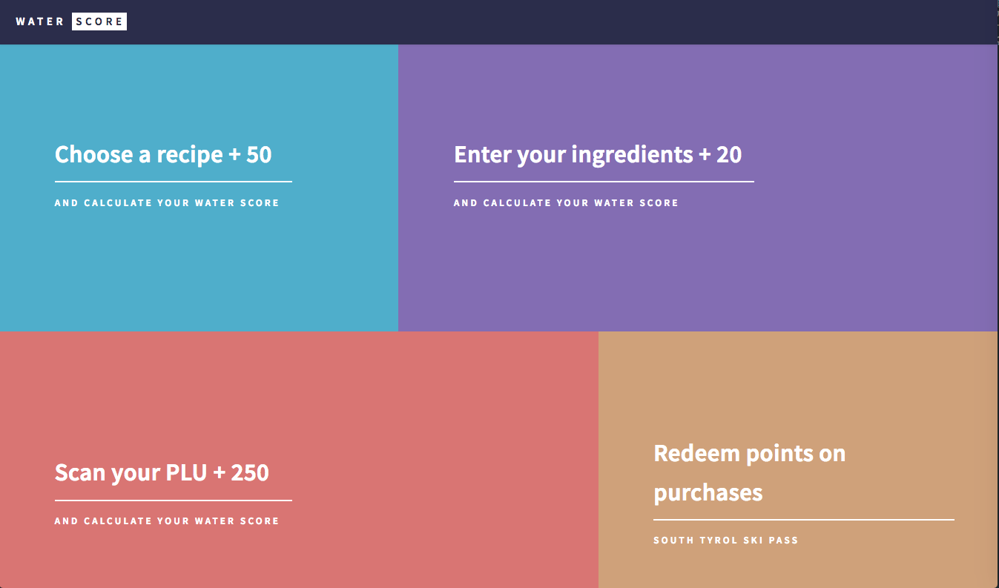
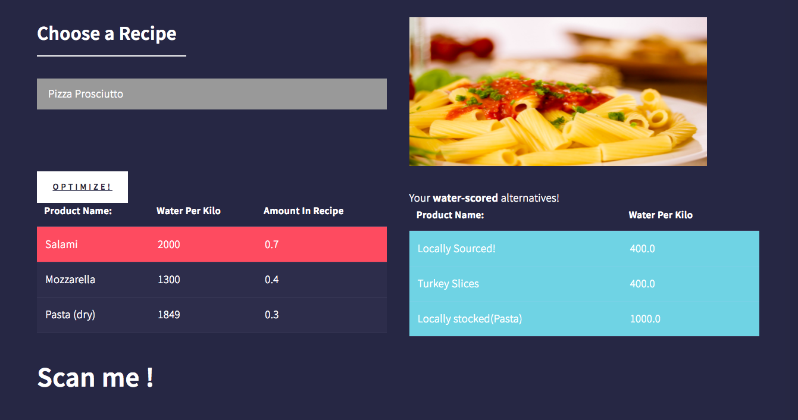

# Water Score
Bolzano Hackathon for sustainability

# Application Features: 

1. Search for the water score of datas 
2. Compose low-water cost recipes by region

# Getting started

Install a virtual env or use the env

To run `flask-mw/python app.py`,
